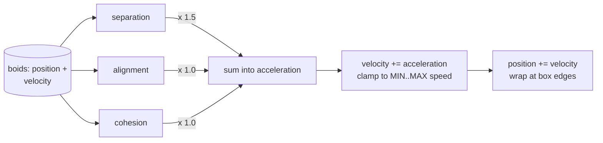

# Boids in one HTML file with three.js

It's dusk over a lake, and ten thousand starlings are doing something no choreographer could direct. The flock stretches, folds, and rotates as a single object — yet no bird is in charge. In 1986, Craig Reynolds made a computer model of exactly that motion — bird flocks and fish schools — and documented the algorithm in his paper *Flocks, Herds, and Schools: A Distributed Behavioral Model*. The model is small: each simulated creature maneuvers based only on the positions and velocities of its nearby flockmates, using three rules — **separation**, **alignment**, **cohesion**. There is no flock object, no steering plan, no leader; the flock is just the pattern those three rules make, and Reynolds documented it all on one unassuming web page.

The surprising part is how little code that takes. The flocking logic — all three rules, the physics, the boundaries — is a few dozen lines of vector arithmetic. Everything else is the standard three.js stage: a scene, a camera, a renderer, a loop.

By the end of this part, you'll have a single file named `boids.html`. Serve it with a one-line local server and 150 cone-shaped boids flock through a box of air: they dodge each other, match their neighbors' headings, drift toward their local center, and wrap around the edges. three.js 0.185.1 from a CDN, no build step, no packages to install.

## What you'll build

One file, `boids.html`, that you serve from your machine and watch a flock form in the browser. The boids are rendered as 150 small cones drawn in a single GPU draw call via an `InstancedMesh`; their motion comes from the three Reynolds rules computed per frame with `Vector3` math; the whole thing loads three.js 0.185.1 straight from a CDN through an import map. If you've touched JavaScript but haven't used ES modules or three.js before, this part teaches both as it goes.

## Prerequisites

- A current desktop browser with WebGL 2. three.js has required WebGL 2 since r163 and no longer supports WebGL 1 ([WebGLRenderer reference](https://threejs.org/docs/pages/WebGLRenderer.html)).
- Comfort with JavaScript itself: functions, loops, arrays, objects.
- Vectors as `(x, y, z)` triples. That's the entire math requirement — the flocking code uses only addition, subtraction, scalar multiplication, and a couple of square roots. No trigonometry needed.
- Node.js (any recent version) for the one-line local server in [Running it](#running-it) — or Python 3 if you'd rather.
- No three.js experience. That's the point.

## The three rules behind the flock

Reynolds's model starts from one observation: a bird doesn't need to see the flock. It needs to see its neighbors. In the original model, a boid "reacts only to flockmates within a certain small neighborhood around itself," and that neighborhood is defined by two numbers — a *distance* from the boid's center and an *angle* from its direction of flight; flockmates outside it are ignored. The reaction is three steering behaviors, in Reynolds's own one-line definitions from [his boids page](http://www.red3d.com/cwr/boids/):

- **Separation** — "steer to avoid crowding local flockmates."
- **Alignment** — "steer towards the average heading of local flockmates."
- **Cohesion** — "steer to move toward the average position of local flockmates."

> [!ASIDE]
> Reynolds called the generic simulated flocking creature a **boid** — in Nature of Code's gloss, "a made-up word that refers to a birdlike object." The word stuck: every flocking simulation since has used it.

Put three rules that act only locally on every agent, and something global appears: a flock. [Nature of Code's autonomous-agents chapter](https://natureofcode.com/autonomous-agents/) puts it well — the result is "a complex system—intelligent group behavior will emerge from the simple rules of flocking without the presence of a centralized system or leader" — and it suggests the cleanest way to feel that: try taking out just the cooperation (cohesion and alignment) or just the competition (separation) and you'll see "how the system loses its complexity." You'll do exactly that in the exercises.

```svg
<svg viewBox="0 0 460 300" role="img" aria-label="One boid A with six neighbors inside the 8-unit neighborhood and three crowded neighbors inside the 3-unit separation distance">
  <circle cx="230" cy="108" r="96" fill="none" stroke="currentColor" stroke-width="1.5" stroke-dasharray="5 5" opacity="0.5"/>
  <circle cx="230" cy="108" r="36" fill="none" stroke="#e07850" stroke-width="1.5" stroke-dasharray="4 4" opacity="0.85"/>
  <text x="230" y="10" text-anchor="middle" font-size="11" font-family="sans-serif" fill="currentColor" opacity="0.75">NEIGHBOR_DISTANCE: 8 units</text>
  <text x="266" y="88" font-size="11" font-family="sans-serif" fill="#e07850">SEPARATION_DISTANCE: 3</text>
  <text x="188" y="84" text-anchor="middle" font-size="12" font-family="sans-serif" fill="currentColor">o</text>
  <text x="146" y="96" text-anchor="middle" font-size="12" font-family="sans-serif" fill="currentColor">o</text>
  <text x="170" y="96" text-anchor="middle" font-size="12" font-family="sans-serif" fill="currentColor">o</text>
  <text x="146" y="120" text-anchor="middle" font-size="12" font-family="sans-serif" fill="currentColor">o</text>
  <text x="150" y="150" text-anchor="middle" font-size="12" font-family="sans-serif" fill="currentColor">o</text>
  <text x="188" y="132" text-anchor="middle" font-size="12" font-family="sans-serif" fill="currentColor">o</text>
  <text x="224" y="96" text-anchor="middle" font-size="12" font-family="sans-serif" fill="#e07850">*</text>
  <text x="212" y="108" text-anchor="middle" font-size="12" font-family="sans-serif" fill="#e07850">*</text>
  <text x="248" y="108" text-anchor="middle" font-size="12" font-family="sans-serif" fill="#e07850">*</text>
  <text x="230" y="108" text-anchor="middle" font-size="13" font-family="sans-serif" font-weight="bold" fill="currentColor">A</text>
  <text x="20" y="228" font-size="11" font-family="sans-serif" fill="currentColor">A  = one boid&#160;&#160;&#160;&#160;&#160;&#160;&#160;&#160;o  = neighbor within 8 units&#160;&#160;&#160;&#160;&#160;&#160;*  = crowded neighbor within 3 units</text>
  <text x="20" y="250" font-size="11" font-family="sans-serif" fill="currentColor">separation = steer away from the crowded side (the * neighbors)</text>
  <text x="20" y="268" font-size="11" font-family="sans-serif" fill="currentColor">alignment = match the average heading of the o neighbors</text>
  <text x="20" y="286" font-size="11" font-family="sans-serif" fill="currentColor">cohesion = drift toward the center of mass of the o neighbors</text>
</svg>
```

Look at the `*` cluster before the rules: separation doesn't know about "crowding" as a concept — it only sums "away from each too-close neighbor" vectors. The escape from the crowded side is what you see, not what it computes.

One honesty note before the code: checking every boid against every other boid costs N² distance tests per rule per frame. For 150 boids that's 22,500 per rule — nothing. At 1,000 boids it's 1,000,000 per rule, "getting rather slow" by [Nature of Code's](https://natureofcode.com/autonomous-agents/) reckoning; at 10,000, 100,000,000 — "really, really, really slow." This part deliberately leaves the naive N² loop in place so the rules stay readable. Moving that wall is the job of a later part, using the spatial binning ("bin-lattice spatial subdivision") Reynolds proposed in his 2000 paper on autonomous character groups.

Next, the container: one HTML file that can load three.js at all.

## A file, a module, and an import map

The whole tutorial lives in one file. Here's the skeleton — every later section drops a block into the `<script type="module">` at the bottom:

```html
<!DOCTYPE html>
<html>
<head>
  <meta charset="utf-8">
  <title>Boids</title>
  <style>
    body { margin: 0; background: #0b1220; }
    canvas { display: block; }
  </style>
  <script type="importmap">
    {
      "imports": {
        "three": "https://cdn.jsdelivr.net/npm/three@0.185.1/build/three.module.js"
      }
    }
  </script>
</head>
<body>
<script type="module">
import * as THREE from 'three';
</script>
</body>
</html>
```

Three things in this skeleton do real work. One by one:

**`<script type="module">`** makes the script an ES module — three.js has shipped only as an ES module since r147, so `import` is the entry point to the library. Modules also give you `export`, run in strict mode, and execute after the document is parsed. If you've written plain script tags before, that last part is the quiet difference: a module never runs before the HTML it references exists.

**`import * as THREE from 'three'`** imports the entire three.js library under the name `THREE`. Here's the trap most first-timers hit: `'three'` is a *bare specifier* — a package name, not a URL. Node can resolve bare names (it looks in `node_modules`), but browsers can't, and there is no `node_modules` in a browser. Without a map, the browser has no idea what `'three'` means and the import fails.

**`<script type="importmap">`** is the browser's answer: a JSON block that maps bare names to real URLs. The [installation guide](https://threejs.org/manual/en/installation.html) says it directly: "We imported code from 'three' (an npm package) in `main.js`, and web browsers don't know what that means. In `index.html` we'll need to add an import map defining where to get the package." Ours maps `'three'` to one exact file on the jsDelivr CDN.

> [!HEADS-UP]
> The import map must appear **before** the module script that uses it — it's a registration, not a lookup that can happen later. If you see `Failed to resolve module specifier "three"` in the console, the map is missing, malformed JSON, or sitting after the `<script type="module">` tag.

Two deliberate choices in the URL:

1. **The version is pinned.** `three@0.185.1` points at one specific release. The installation guide's template says `three@<version>` and tells you to replace it with an actual version from the [npm version list](https://www.npmjs.com/package/three?activeTab=versions). Pinning is what makes this file reproducible: the file you save today loads the same code in a year. 0.185.1 is the current stable release as of writing.
2. **One CDN, one version, for everything.** The guide's production note is emphatic: "Import all dependencies from the same version of three.js, and from the same CDN. Mixing files from different sources may cause duplicate code to be included, or even break the application in unexpected ways." We only need the core library, so our map has one entry. If you later add a three.js addon (a camera controller, a model loader), you'll add a second entry — `"three/addons/"` — pointing at the *same* CDN and *same* version, per the [addons section](https://threejs.org/manual/en/installation.html) of the guide.

### Running it

The installation guide's no-build setup runs the page from a local server:

```bash
npx serve .
```

Then open the URL it prints with `/boids.html` appended. (If you don't use Node, `python3 -m http.server 3000` in the same folder serves the same purpose.)

Why a server for a file whose only import comes from a CDN? Because that's the habit that keeps working: the guide is explicit that "while it's technically possible to double-click an HTML file and open it in your browser, important features … do not work when the page is opened this way, for security reasons" — and module loading from `file://` is one of the things that breaks. Our file gets away with double-clicking *today* only because its one import is a cross-origin URL, and that's luck we don't want to build on: the moment you add a local texture or a second local script, the double-clicked page dies. So: server is the setup, double-click is a tolerated fallback.

With the skeleton saved as `boids.html`, open it now. You should get a dark navy page and an empty console. Nothing is drawn yet — there's no scene. That's next.

## The stage: scene, camera, renderer

A three.js app is a set of objects wired together: a **renderer** draws a **scene** from the point of view of a **camera**. The [fundamentals guide](https://threejs.org/manual/en/fundamentals.html) describes exactly that structure, and the minimum working set is four lines each for scene, camera, and renderer. Add them to the module script — in the complete file the stage sits right after the `import`, before the tuning knobs:

```js
const scene = new THREE.Scene();
scene.background = new THREE.Color(0x0b1220);
```

The scene is the root of the object graph — "anything you want three.js to draw needs to be added to the scene," in the guide's words. It also carries a background color, which we set to a dark navy: the dusk-sky look, and a backdrop that makes pale cones read well. Colors are written as the usual six-digit hex values.

```js
const camera = new THREE.PerspectiveCamera(
  60,                                   // vertical field of view, in degrees
  window.innerWidth / window.innerHeight, // aspect: canvas width / height
  0.1,                                  // near clipping plane
  1000                                  // far clipping plane
);
camera.position.z = 80;
```

A perspective camera defines a **frustum** — in the guide's words, "a 3d shape that is like a pyramid with the tip sliced off." Anything inside it gets drawn; anything outside doesn't. The four constructor values shape the frustum: the vertical field of view in degrees (yes, degrees — most three.js angles are radians, but the perspective camera's constructor takes degrees), the aspect ratio of the canvas, and the near/far clipping distances. The camera "defaults to looking down the -Z axis with +Y up," so placing it at `z = 80` points it straight at the origin, 80 units back. Our flock will live in a box 60 units wide, so this framing gives it room to move.

```js
const renderer = new THREE.WebGLRenderer({ antialias: true });
renderer.setSize(window.innerWidth, window.innerHeight);
document.body.appendChild(renderer.domElement);
```

The renderer is the piece that turns the scene and camera into pixels — the [WebGLRenderer reference](https://threejs.org/docs/pages/WebGLRenderer.html) describes it in one line: "This renderer uses WebGL 2 to display scenes." We don't pass it a canvas, so it creates one for us: `domElement` is "a canvas where the renderer draws its output," "automatically created by the renderer in the constructor (if not provided already); you just need to add it to your page," and the reference's own snippet is `document.body.appendChild(renderer.domElement)`. `setSize` makes that canvas fill the window. The `antialias: true` option turns on anti-aliasing so the cone edges don't shimmer.

Still nothing on screen — the scene is empty and nothing has called `render` yet. But the stage is built, and the most important design note for this part comes with the next piece. A three.js **Mesh** is a pairing of a **Geometry** (the shape) and a **Material** (how it's shaded), plus a position and orientation. The fundamentals guide makes the point with two blue cubes: two meshes, but one geometry and one material shared between them. That sharing is the seed of what we'll do with 150 boids in [One cone, one draw call](#one-cone-one-draw-call-instanced-rendering) — but first, the boids themselves, which are just data.

## Boids as data: position, velocity, acceleration

A boid isn't a class in this part. It's a plain object with three vectors, and a flock is an array of them — the same structure [Nature of Code](https://natureofcode.com/autonomous-agents/) uses, where its `Flock` class holds a plain array of boid objects and hands the whole array to each boid's `run()`.

The tuning knobs first — in the complete file this block sits right after the stage setup (everything lives in one `<script type="module">` tag, in the order you read this part):

```js
const BOID_COUNT = 150;
const MAX_SPEED = 1.0;     // units per frame
const MIN_SPEED = 0.4;     // floor, so the flock never stalls
const MAX_FORCE = 0.04;    // how hard a boid can steer per frame
const NEIGHBOR_DISTANCE = 8;
const SEPARATION_DISTANCE = 3;
const WEIGHTS = { separation: 1.5, alignment: 1.0, cohesion: 1.0 };
const WORLD = { x: 30, y: 18, z: 18 }; // half-extents of the box
```

Then the flock itself, right below:

```js
function randomInBox() {
  return new THREE.Vector3(
    (Math.random() * 2 - 1) * WORLD.x,
    (Math.random() * 2 - 1) * WORLD.y,
    (Math.random() * 2 - 1) * WORLD.z,
  );
}

const boids = [];
for (let i = 0; i < BOID_COUNT; i++) {
  const velocity = new THREE.Vector3(
    Math.random() * 2 - 1,
    Math.random() * 2 - 1,
    Math.random() * 2 - 1,
  ).setLength(MAX_SPEED / 2);
  boids.push({
    position: randomInBox(),
    velocity,
    acceleration: new THREE.Vector3(),
  });
}
```

Read it as two halves.

The constants are every knob this part has. `MAX_SPEED` and `MAX_FORCE` are per-boid limits; `NEIGHBOR_DISTANCE` is how far a boid can see for alignment and cohesion; `SEPARATION_DISTANCE` is its personal space; `WEIGHTS` says how much each rule counts when the three disagree — the 1.5/1.0/1.0 values are the ones Nature of Code uses in its boids example, and they're the values that produce a healthy flock rather than a blob. `WORLD` holds half the extent of each axis, so the boids live in a box from −30 to +30 on x, −18 to +18 on y and z.

The array fills with boids scattered in that box, each with a random heading at half speed. The one three.js method doing real work is [`Vector3.setLength`](https://threejs.org/docs/pages/Vector3.html) — "sets this vector to a vector with the same direction as this one, but with the specified length." Random direction, exact speed.

The motion model is the oldest one in physics, applied per frame:

```
acceleration = sum of steering forces
velocity     += acceleration
position     += velocity
```

Nature of Code's `update()` is exactly this — add acceleration to velocity, clamp velocity to the maximum speed, add velocity to position. Two notes on the units, because they'll matter when you tune things:

- **Everything is per-frame.** There is no `dt` and no clock in this model; a speed of `1.0` means "1 unit per rendered frame." At 60 fps that's 60 units/second; on a 120 Hz display the same flock moves twice as fast. Frame-based timing is how Reynolds's examples and Nature of Code's both work, and it keeps the arithmetic honest. Making the simulation clock-based is a later part.
- **`MIN_SPEED` is a design choice, not a rule of flocking.** The reference implementations only cap the top speed (Nature of Code's `update()` does `this.velocity.limit(this.maxspeed)`). Without a floor, a boid boxed between neighbors can bleed to a crawl and the flock gets dead spots. A murmuration doesn't hover, so we clamp velocity to the range `[MIN_SPEED, MAX_SPEED]` instead of just `[0, MAX_SPEED]`. Try removing it in the exercises and see what stalls.

Boids that leave the box shouldn't die; they should come back around. The classic boids boundary is a torus — wrap one side to the other:

```js
function wrap(boid) {
  if (boid.position.x >  WORLD.x) boid.position.x -= 2 * WORLD.x;
  if (boid.position.x < -WORLD.x) boid.position.x += 2 * WORLD.x;
  if (boid.position.y >  WORLD.y) boid.position.y -= 2 * WORLD.y;
  if (boid.position.y < -WORLD.y) boid.position.y += 2 * WORLD.y;
  if (boid.position.z >  WORLD.z) boid.position.z -= 2 * WORLD.z;
  if (boid.position.z < -WORLD.z) boid.position.z += 2 * WORLD.z;
}
```

In the complete file, `wrap` sits with the rendering code at the bottom — it's only called from `updateBoids` — but read it here, with the data it moves. A boid that crosses past `+30` on x reappears at `−30` — it jumped by exactly the box's width, `2 * WORLD.x`. Old arcade games did this with spaceships; the flock gets it for free.

Now the data moves, but nothing computes forces yet. That's the steering formula — the one idea all three rules share.

## The steering formula: desired minus current

Every steering behavior in Reynolds's model answers one question: *what velocity would I like to have right now?* The answer — the **desired velocity** — is a direction at full speed. The force is then the difference between that desire and reality, capped so the boid can't snap its heading:

```js
function steerToward(desired, boid) {
  if (desired.lengthSq() === 0) return new THREE.Vector3();
  const steer = desired.setLength(MAX_SPEED).sub(boid.velocity);
  return steer.clampLength(0, MAX_FORCE);
}
```

In the complete file this function sits at the bottom with the rendering code — the rules reference each other, and JavaScript function declarations hoist, so where you write them doesn't constrain where you call them. Read it here, right after the data it serves. This function is the entire engine; the three rules are just three ways of computing `desired`.

Line by line:

- `desired.setLength(MAX_SPEED)` rescales the desired direction to exactly `MAX_SPEED`. A boid always wants to be moving at full speed — the direction is the decision, the speed is constant.
- `.sub(boid.velocity)` gives **steer = desired − current**. This is the formula Reynolds's model is built on, and Nature of Code states it plainly: the steering force equals the desired velocity minus the current velocity. It's a *correction*, not a command. A boid already heading the desired way gets nearly zero force; one heading the wrong way gets the maximum. That difference is what makes the flock turn in arcs instead of jittering between waypoints.
- `steer.clampLength(0, MAX_FORCE)` caps the force at `MAX_FORCE`. A boid can only turn so fast, and that cap is what produces the smooth, sweeping curves.

The two `Vector3` methods deserve their names, because the p5.js code you may have seen uses different ones. `setLength` sets the magnitude in place. `clampLength(min, max)` — "If this vector's length is greater than the max value, it is replaced by the max value" — is the cap; p5.js calls the single-cap version `limit`, three.js's [`Vector3`](https://threejs.org/docs/pages/Vector3.html) does not have `limit`, and reaching for it is the most common copy-paste wound in boids ports.

The first line is a guard with a reason: if `desired` is exactly zero, there is no direction to normalize, and `setLength` on a zero vector produces NaN, which then poisons the boid's velocity permanently and it vanishes. When can `desired` be zero? When the neighbors cancel exactly — a boid with equally strong neighbors on opposite sides. With continuous random positions it's a near-impossibility; with a guard it's an impossibility. Cheap insurance.

The formula is in place. Now the three rules, each a few lines: compute a `desired`, hand it to `steerToward`, done.

## Separation: personal space

Separation is the only rule that looks at *distance to specific neighbors* rather than an average. For each neighbor inside `SEPARATION_DISTANCE`, compute a vector pointing away from that neighbor, weighted so that closer neighbors push harder — then sum. Nature of Code's `separate()` does exactly this, including the inverse-distance weighting — "the magnitude of the vector pointing away from a neighboring vehicle is set to be inversely proportional to the distance. This means that the closer the neighbor, the more the vehicle wants to flee, and vice versa."

```js
function separation(boid) {
  const sum = new THREE.Vector3();
  let count = 0;
  for (const other of boids) {
    if (other === boid) continue;
    const d2 = boid.position.distanceToSquared(other.position);
    if (d2 < SEPARATION_DISTANCE * SEPARATION_DISTANCE && d2 > 0) {
      sum.addScaledVector(
        new THREE.Vector3().subVectors(boid.position, other.position),
        1 / d2,
      );
      count++;
    }
  }
  return count > 0 ? steerToward(sum, boid) : new THREE.Vector3();
}
```

In the complete file, the three rules sit together at the bottom of the script, in the order you're reading them now. The details that earn their keep:

- `other === boid` skips the boid itself. The flock array contains the boid doing the checking; without the skip, every boid would be fleeing itself. Nature of Code calls this out as a key element.
- `distanceToSquared` is the fast path: it's `dx² + dy² + dz²` with no square root. We compare against the *squared* radius for the same reason. This is one of Nature of Code's optimization tips — "use the magnitude squared" — and it's free here because we don't need the plain distance in this rule.
- The weighting is `1 / d2`, where `d2` is the *squared* distance. `subVectors(boid.position, other.position)` is a vector of length `d` pointing away from the neighbor; scaling it by `1/d²` leaves a vector of length `1/d`. Closer neighbor, longer push. That's the "inverse proportional to the distance" weighting, written without a square root.
- The `d2 > 0` clause handles the degenerate case of two boids at exactly the same position — there's no defined "away" from zero distance, and `1/d2` would be infinity.
- `sum` is the desired velocity's direction: the net "away from the crowd" direction. `steerToward` rescales it to `MAX_SPEED` and caps it, as always. (NoC's example averages the away-vectors across the crowded neighbors first and then seeks that average; we hand the un-averaged sum to the same steering formula, which normalizes the direction anyway — same behavior, one fewer temporary.)

The rule returns a force vector, or zero if there's nobody too close. Next rule: the one that makes the flock *flow*.

## Alignment: matching the flow

Alignment is the rule that makes the flock *flow*: look at every neighbor within `NEIGHBOR_DISTANCE`, take their average velocity, and steer toward that average direction. Nature of Code's `align()` sums the neighbors' velocities within the distance, scales the sum to the maximum speed, and runs the steering formula. It sums without dividing by the count — NoC notes in a code comment that it "really don't have to divide by count anymore since the magnitude is set manually" — and that's exactly the liberty we take: `steerToward` rescales to `MAX_SPEED` anyway, so only the *direction* of the sum matters, not its magnitude. Same direction, fewer operations.

```js
function alignment(boid) {
  const sum = new THREE.Vector3();
  let count = 0;
  for (const other of boids) {
    if (other === boid) continue;
    if (boid.position.distanceToSquared(other.position)
        < NEIGHBOR_DISTANCE * NEIGHBOR_DISTANCE) {
      sum.add(other.velocity);
      count++;
    }
  }
  return count > 0 ? steerToward(sum, boid) : new THREE.Vector3();
}
```

The `count > 0` guard is the quiet half of the function: a boid with no neighbors in reach gets zero force from this rule, not a bogus vector. It goes with the other two rules, at the bottom.

This is the rule that gives the flock its *motion* — the shared heading that makes a thousand cones point the same way. Without it, separation and cohesion produce a blob that jitters in place; with it, the blob starts streaming.

## Cohesion: staying with the group

Cohesion is alignment's mirror: instead of averaging neighbors' *velocities*, average their *positions* — the local center of mass — and steer toward it. NoC's cohesion code is "quite similar to that for alignment": it calculates the average position of the boid's neighbors "(and use that as a target to seek)" — which is exactly `steerToward` with `desired = center − position`.

```js
function cohesion(boid) {
  const sum = new THREE.Vector3();
  let count = 0;
  for (const other of boids) {
    if (other === boid) continue;
    if (boid.position.distanceToSquared(other.position)
        < NEIGHBOR_DISTANCE * NEIGHBOR_DISTANCE) {
      sum.add(other.position);
      count++;
    }
  }
  if (count === 0) return new THREE.Vector3();
  sum.divideScalar(count);
  return steerToward(sum.sub(boid.position), boid);
}
```

It joins the other two rules at the bottom. Two things differ from the alignment rule, deliberately:

- `sum.divideScalar(count)` computes the actual center. The division is optional — `steerToward` will rescale the direction anyway — but the average position is the rule's real target, and writing it out as a point makes the code read exactly like the rule.
- `sum.sub(boid.position)` reuses `sum` for the desired vector: center minus position. `sub` returns `this`, so `steerToward` receives that vector and works on it.

That's all three rules. Each one is a loop over the flock, a sum, and a call to `steerToward`. The flocking behavior you're about to see is the interference pattern of those three sums, weighted and added per frame.

## The frame loop: three weighted forces, two passes

The per-frame pipeline is short enough to draw:



Look at the seam between the force block and the velocity block. That seam is a decision: **every boid decides before any boid moves.** We compute all 150 accelerations from this frame's positions, then apply all 150 moves. If instead we interleaved — boid 0 decides and moves, then boid 1 decides and moves — boid 1 would react to boid 0's *new* position while boid 0 reacted to boid 1's *old* one. The flock would still form, but it would carry a subtle order bias: boids later in the array always see fresher data. The two-pass update makes the simulation symmetric: every boid's decision is made from the same snapshot of the world — the model as a set of behaviors each boid applies, not a sequence.

```js
function updateBoids() {
  // Pass 1: everyone decides, using this frame's positions.
  for (const boid of boids) {
    boid.acceleration.set(0, 0, 0);
    boid.acceleration.addScaledVector(separation(boid), WEIGHTS.separation);
    boid.acceleration.addScaledVector(alignment(boid), WEIGHTS.alignment);
    boid.acceleration.addScaledVector(cohesion(boid), WEIGHTS.cohesion);
  }
  // Pass 2: everyone moves at the same time.
  for (const boid of boids) {
    boid.velocity.add(boid.acceleration);
    boid.velocity.clampLength(MIN_SPEED, MAX_SPEED);
    boid.position.add(boid.velocity);
    wrap(boid);
  }
}
```

In the complete file `updateBoids` (with `wrap`) sits at the bottom, just above the rendering code — it's the one function the loop calls. The weights do what their name says: `addScaledVector(v, s)` adds `v * s`, so separation counts one and a half times as hard as the others. That's the 1.5/1.0/1.0 from Nature of Code's boids example, where the three forces are weighted before being added together — strong enough separation that the flock keeps its shape instead of collapsing.

> [!DESIGN-NOTE]
> **Why a plain array and not a Boid class?**
>
> Nature of Code wraps the same logic in `Boid` and `Flock` classes; the behavior is identical either way. Plain objects in an array keep the file short and put the physics in free functions you can read top to bottom. When a later part adds per-boid rendering state or a spatial grid, the array stays — the grid will index it. The class is a packaging choice, not a behavior one.

The simulation is complete and would run correctly right now — invisibly. The last piece makes the boids visible, and it's the piece that lets 150 of them cost one draw call.

## One cone, one draw call: instanced rendering

The obvious way to draw 150 boids is 150 meshes. It works, and it's the wrong shape for the problem: each mesh is a separate draw call, and the GPU re-prepares for every one. three.js's [`InstancedMesh`](https://threejs.org/docs/pages/InstancedMesh.html) exists for exactly this case — one geometry, one material, drawn `count` times, with a per-instance matrix supplying each copy's position and rotation. The reference describes the payoff directly: "the usage of 'InstancedMesh' will help you to reduce the number of draw calls and thus improve the overall rendering performance in your application."

The boid shape is a cone — something with a front, so the boid's heading is visible. `ConeGeometry(radius, height, radialSegments)` builds one: a 0.35-radius, 1.1-tall cone with 5 sides around, which reads as an arrowhead at this scale. The cone's tip points along `+Y` in its own local space — that fact drives the rotation code below.

```js
const geometry = new THREE.ConeGeometry(0.35, 1.1, 5);
const material = new THREE.MeshBasicMaterial({ color: 0x9fd3ff });
const boidMesh = new THREE.InstancedMesh(geometry, material, boids.length);
scene.add(boidMesh);
```

In the complete file this sits just below `wrap` — the simulation code ends, rendering begins. One geometry, one material, 150 instances — the shared-resources pattern from the stage section, pushed to its conclusion. The material is `MeshBasicMaterial`, a flat unlit color: the fundamentals guide notes it "is not affected by lights," which is precisely why we're using it — no lights to set up, no shading to reason about, just pale blue cones on dark navy. When you want shaded boids, the upgrade path is `MeshPhongMaterial` plus a light, also in the fundamentals guide.

Each instance's transform goes into its slot with `setMatrixAt(index, matrix)`. Building the matrix is where a small trick earns its keep. An [`Object3D`](https://threejs.org/docs/pages/Object3D.html) keeps `position`, `quaternion` (rotation), and `scale`, and `updateMatrix()` composes them into the `.matrix` — "the transformation matrix in local space." So we keep one throwaway `Object3D` — the conventional name is `dummy` — pose it like each boid in turn, and copy its matrix into the instance:

```js
const UP = new THREE.Vector3(0, 1, 0); // a cone points along +Y
const dummy = new THREE.Object3D();    // scratch object holding one transform
const dir = new THREE.Vector3();       // scratch vector for "heading"

function drawBoids() {
  for (let i = 0; i < boids.length; i++) {
    const boid = boids[i];
    dummy.position.copy(boid.position);
    dir.copy(boid.velocity).normalize();
    dummy.quaternion.setFromUnitVectors(UP, dir);
    dummy.updateMatrix();
    boidMesh.setMatrixAt(i, dummy.matrix);
  }
  boidMesh.instanceMatrix.needsUpdate = true;
}
```

Add it below the mesh setup. The rotation line is the whole trick: [`Quaternion.setFromUnitVectors(vFrom, vTo)`](https://threejs.org/docs/pages/Quaternion.html) "sets this quaternion to the rotation required to rotate the direction vector `vFrom` to the direction vector `vTo`." We ask for the rotation from `+Y` (the cone's built-in pointing direction) to the boid's normalized velocity — and the cone points where the boid is going. Two details:

- `dir.copy(boid.velocity).normalize()` uses a scratch vector on purpose. `normalize()` mutates in place; calling it directly on `boid.velocity` would shrink every boid's speed to 1 and wreck the physics.
- `dummy` and `dir` are allocated once, outside the loop, and reused for all 150 boids. This is the other half of Nature of Code's optimization advice — "don't make gazillions of unnecessary p5.Vector objects" (three.js's `Vector3` in our case). The first tip was squared distances to avoid square roots; this one is reusing vectors to avoid allocations.

The final line matters as much as any method in the file. `instanceMatrix` is the GPU buffer holding all 150 matrices; changing it in JS does not tell the GPU anything. Setting `instanceMatrix.needsUpdate = true` after the loop is what marks the buffer for re-upload. Skip it and the boids render once at the origin and never move — a perfectly still pile of 150 cones is the signature of this exact bug.

The last three lines start the loop:

```js
function tick() {
  requestAnimationFrame(tick);
  updateBoids();
  drawBoids();
  renderer.render(scene, camera);
}
requestAnimationFrame(tick);
```

`requestAnimationFrame` is the browser's animation hook: hand it a function, the browser calls it before the next repaint, and calling it again from inside keeps the loop alive. The fundamentals guide shows this exact shape, including the one call outside the loop to start it. The callback receives a timestamp in milliseconds; we don't use it — frame-based physics, as decided. (The [WebGLRenderer reference](https://threejs.org/docs/pages/WebGLRenderer.html) notes that `renderer.setAnimationLoop(callback)` is the officially recommended alternative to a manual `requestAnimationFrame` loop; both work, and the manual loop keeps the frame's shape visible.)

Everything is written. Here is the file in full, so you can check the seams.

## The complete file

`boids.html` — save it next to nothing, serve the folder, open it:

```html
<!DOCTYPE html>
<html>
<head>
  <meta charset="utf-8">
  <title>Boids</title>
  <style>
    body { margin: 0; background: #0b1220; }
    canvas { display: block; }
  </style>
  <script type="importmap">
    {
      "imports": {
        "three": "https://cdn.jsdelivr.net/npm/three@0.185.1/build/three.module.js"
      }
    }
  </script>
</head>
<body>
<script type="module">
import * as THREE from 'three';

// --- Tuning ---
const BOID_COUNT = 150;
const MAX_SPEED = 1.0;     // units per frame
const MIN_SPEED = 0.4;     // floor, so the flock never stalls
const MAX_FORCE = 0.04;    // how hard a boid can steer per frame
const NEIGHBOR_DISTANCE = 8;
const SEPARATION_DISTANCE = 3;
const WEIGHTS = { separation: 1.5, alignment: 1.0, cohesion: 1.0 };
const WORLD = { x: 30, y: 18, z: 18 }; // half-extents of the box

// --- The stage ---
const scene = new THREE.Scene();
scene.background = new THREE.Color(0x0b1220);

const camera = new THREE.PerspectiveCamera(
  60,                                   // vertical field of view, in degrees
  window.innerWidth / window.innerHeight, // aspect: canvas width / height
  0.1,                                  // near clipping plane
  1000                                  // far clipping plane
);
camera.position.z = 80;

const renderer = new THREE.WebGLRenderer({ antialias: true });
renderer.setSize(window.innerWidth, window.innerHeight);
document.body.appendChild(renderer.domElement);

// --- The flock: plain objects in an array ---
function randomInBox() {
  return new THREE.Vector3(
    (Math.random() * 2 - 1) * WORLD.x,
    (Math.random() * 2 - 1) * WORLD.y,
    (Math.random() * 2 - 1) * WORLD.z,
  );
}

const boids = [];
for (let i = 0; i < BOID_COUNT; i++) {
  const velocity = new THREE.Vector3(
    Math.random() * 2 - 1,
    Math.random() * 2 - 1,
    Math.random() * 2 - 1,
  ).setLength(MAX_SPEED / 2);
  boids.push({
    position: randomInBox(),
    velocity,
    acceleration: new THREE.Vector3(),
  });
}

// --- The steering formula: every behavior is a desired velocity ---
function steerToward(desired, boid) {
  if (desired.lengthSq() === 0) return new THREE.Vector3();
  const steer = desired.setLength(MAX_SPEED).sub(boid.velocity);
  return steer.clampLength(0, MAX_FORCE);
}

function separation(boid) {
  const sum = new THREE.Vector3();
  let count = 0;
  for (const other of boids) {
    if (other === boid) continue;
    const d2 = boid.position.distanceToSquared(other.position);
    if (d2 < SEPARATION_DISTANCE * SEPARATION_DISTANCE && d2 > 0) {
      sum.addScaledVector(
        new THREE.Vector3().subVectors(boid.position, other.position),
        1 / d2,
      );
      count++;
    }
  }
  return count > 0 ? steerToward(sum, boid) : new THREE.Vector3();
}

function alignment(boid) {
  const sum = new THREE.Vector3();
  let count = 0;
  for (const other of boids) {
    if (other === boid) continue;
    if (boid.position.distanceToSquared(other.position)
        < NEIGHBOR_DISTANCE * NEIGHBOR_DISTANCE) {
      sum.add(other.velocity);
      count++;
    }
  }
  return count > 0 ? steerToward(sum, boid) : new THREE.Vector3();
}

function cohesion(boid) {
  const sum = new THREE.Vector3();
  let count = 0;
  for (const other of boids) {
    if (other === boid) continue;
    if (boid.position.distanceToSquared(other.position)
        < NEIGHBOR_DISTANCE * NEIGHBOR_DISTANCE) {
      sum.add(other.position);
      count++;
    }
  }
  if (count === 0) return new THREE.Vector3();
  sum.divideScalar(count);
  return steerToward(sum.sub(boid.position), boid);
}

function updateBoids() {
  // Pass 1: everyone decides, using this frame's positions.
  for (const boid of boids) {
    boid.acceleration.set(0, 0, 0);
    boid.acceleration.addScaledVector(separation(boid), WEIGHTS.separation);
    boid.acceleration.addScaledVector(alignment(boid), WEIGHTS.alignment);
    boid.acceleration.addScaledVector(cohesion(boid), WEIGHTS.cohesion);
  }
  // Pass 2: everyone moves at the same time.
  for (const boid of boids) {
    boid.velocity.add(boid.acceleration);
    boid.velocity.clampLength(MIN_SPEED, MAX_SPEED);
    boid.position.add(boid.velocity);
    wrap(boid);
  }
}

function wrap(boid) {
  if (boid.position.x >  WORLD.x) boid.position.x -= 2 * WORLD.x;
  if (boid.position.x < -WORLD.x) boid.position.x += 2 * WORLD.x;
  if (boid.position.y >  WORLD.y) boid.position.y -= 2 * WORLD.y;
  if (boid.position.y < -WORLD.y) boid.position.y += 2 * WORLD.y;
  if (boid.position.z >  WORLD.z) boid.position.z -= 2 * WORLD.z;
  if (boid.position.z < -WORLD.z) boid.position.z += 2 * WORLD.z;
}

// --- Rendering: one cone, drawn 150 times in a single draw call ---
const geometry = new THREE.ConeGeometry(0.35, 1.1, 5);
const material = new THREE.MeshBasicMaterial({ color: 0x9fd3ff });
const boidMesh = new THREE.InstancedMesh(geometry, material, boids.length);
scene.add(boidMesh);

const UP = new THREE.Vector3(0, 1, 0); // a cone points along +Y
const dummy = new THREE.Object3D();    // scratch object holding one transform
const dir = new THREE.Vector3();       // scratch vector for "heading"

function drawBoids() {
  for (let i = 0; i < boids.length; i++) {
    const boid = boids[i];
    dummy.position.copy(boid.position);
    dir.copy(boid.velocity).normalize();
    dummy.quaternion.setFromUnitVectors(UP, dir);
    dummy.updateMatrix();
    boidMesh.setMatrixAt(i, dummy.matrix);
  }
  boidMesh.instanceMatrix.needsUpdate = true;
}

// --- The loop ---
function tick() {
  requestAnimationFrame(tick);
  updateBoids();
  drawBoids();
  renderer.render(scene, camera);
}
requestAnimationFrame(tick);
</script>
</body>
</html>
```

A few honest simplifications, so you know exactly what this file is and isn't:

- **No field-of-view angle.** Reynolds's boids see only neighbors in front of them — distance *and* angle. This version uses distance only, so a boid reacts to neighbors directly behind it. Adding the angle test is one dot product (`Vector3.dot` is right there in the reference), and it's a good first upgrade.
- **Frame-based, not time-based.** On a 120 Hz display the flock runs twice as fast as on a 60 Hz one. Correct clock-based integration is a later part.
- **The window is a fixed frame.** Resizing the browser window doesn't update the canvas size or the camera's aspect ratio. The fix is a `resize` event listener that calls `renderer.setSize` and updates `camera.aspect` — polish, not foundation.
- **The N² neighborhood search stays.** 150 boids is comfortable; 1,000 will start to show; 10,000 won't run. That wall is next part's subject.
- **One edge case is handled by the library.** If a boid's velocity points exactly opposite the cone's default (`−Y`), `setFromUnitVectors` gets two anti-parallel directions; three.js detects that case in the source and rotates 180° about a fixed perpendicular axis (chosen from the largest component) instead of dividing by zero. It doesn't crash; the cone just tumbles. With continuous random velocities the exact hit is a measure-zero event, and nobody would notice at 60 fps anyway.

## Checkpoint

> [!PREDICT]
> Before you load the page: 150 cones, three forces, one box. What do you expect to see in the first two seconds, and what should the flock look like after ten?

**Run this to verify your work:**

```bash
npx serve .
# then open http://localhost:3000/boids.html
```

Expected output: a dark navy page where 150 pale blue cones drift in a loose cloud. Within a few seconds the cloud acquires a shared heading — the whole flock streams, banks, and splits around its own crowded spots, never leaving the box (boids that exit one side reappear on the other). The console stays empty. Open a second tab and confirm the motion continues in the first — `requestAnimationFrame` pauses in background tabs, which is normal.

**Likely errors:**

- If you see `Failed to resolve module specifier "three"` in the console, the import map didn't register: it's missing, has a JSON typo (trailing comma, unquoted key), or sits *after* the `<script type="module">` tag. It must come first.
- If the page loads but you see a solid pile of cones sitting at the center, the animation loop never ran once: the final `requestAnimationFrame(tick);` call is missing, or the module script threw earlier — check the console for the first error, which is always the real one.
- If the browser reports it can't create a WebGL context, your browser or GPU driver isn't offering WebGL 2. Since r163, three.js requires it; try a current Chrome, Firefox, or Safari with hardware acceleration enabled.
- If the network tab shows a 404 for `three.module.js`, the version in the import map is wrong — `three@0.185.1` must be an exact published release, and it is one; check for a typo, and that you're using the same CDN URL this part gave you.
- If `npx` isn't found, Node.js isn't installed or isn't on your PATH. `python3 -m http.server 3000` serves the same purpose and is listed as an equivalent in the installation guide.

Before you move on, answer this in two sentences — the answer that would satisfy a sceptical colleague, not a summary of the code: why is the steering force `desired − velocity` instead of simply setting `velocity = desired`? What would the flock's motion look like if you made that replacement?

## What's next

The flock works, and the file is done for what it is — but the N² search is a time bomb you can already hear ticking: 150 boids costs 22,500 distance checks per rule, 67,500 per frame — comfortable. At 1,000 boids it's 1,000,000 per rule; at 10,000, 100,000,000. That's the wall. How do you check neighbors fast when every boid has to see its neighborhood? The answer is the spatial binning Reynolds proposed in 2000 — a grid of cells so a boid only checks its own cell and its eight neighbors — and the next part is about pushing this flock past 10,000 boids at a steady frame rate.

## Exercises

- [ ] Set `WEIGHTS.separation` to `0` and reload. The flock collapses into a dense, churning blob — cohesion and alignment without competition. Restore `1.5` and watch it re-expand. Then try `WEIGHTS.cohesion: 0` and describe what a flock that aligns but never gathers looks like.
- [ ] Change `NEIGHBOR_DISTANCE` to `3`, reload; then set it to `20` and reload. At 3 you should see many small local groups drifting independently; at 20, one global ball with a single heading. That distance is the flock's scale of "local."
- [ ] Raise `MAX_FORCE` from `0.04` to `0.2`, then drop it to `0.005`. Sharp hooks versus wide lazy arcs. Note the interplay with `MAX_SPEED`: the force cap is the turning limit, and a boid can only follow a curve if it can turn fast enough for the curve.
- [ ] Bump `BOID_COUNT` to `1000`. The frame rate drops — each boid now scans 1,000 others per rule, 3,000,000 distance checks per frame. That's the N² wall doing its job. Leave it at 1000 when you start the next part.
- [ ] Add a fourth behavior, `seek(point)`, that steers toward a fixed point such as `(0, 0, 0)`: build the desired vector with `new THREE.Vector3().subVectors(point, boid.position)` and return `steerToward(desired, boid)`. Wire it into pass 1 of `updateBoids` with weight `0.3` and watch the flock orbit the origin without landing on it — the same steering formula that produces flocking produces seeking, which is the whole point of Reynolds's framework.

## Sources

**Algorithms**

1. [Craig Reynolds — Boids](http://www.red3d.com/cwr/boids/) — the original model: local neighborhood perception and the three steering rules, from the author's own page.
2. [Daniel Shiffman — Nature of Code: Autonomous Agents](https://natureofcode.com/autonomous-agents/) — the steering formula (desired minus current, capped at max force), the separation/alignment/cohesion implementations and their 1.5/1.0/1.0 weights, the O(N²) analysis, the squared-distance optimization, and Reynolds's 2000 bin-lattice reference.

**three.js (r185 documentation)**

3. [Installation](https://threejs.org/manual/en/installation.html) — CDN usage: the import map, replacing `<version>` with a pinned release, the same-CDN/same-version rule, and `npx serve .` for local servers.
4. [Fundamentals](https://threejs.org/manual/en/fundamentals.html) — the scene/camera/renderer/loop skeleton: `type="module"` loading, the perspective camera's frustum and default orientation, `MeshBasicMaterial` and lights, the `requestAnimationFrame` loop.
5. [Vector3](https://threejs.org/docs/pages/Vector3.html) — the force arithmetic: `setLength`, `clampLength`, `distanceToSquared`, `subVectors`, `addScaledVector`.
6. [InstancedMesh](https://threejs.org/docs/pages/InstancedMesh.html) — one geometry drawn N times; `setMatrixAt` and the `instanceMatrix.needsUpdate` flag.
7. [Quaternion](https://threejs.org/docs/pages/Quaternion.html) — `setFromUnitVectors`, which points the cones along each boid's velocity.
8. [ConeGeometry](https://threejs.org/docs/pages/ConeGeometry.html) — the cone's `radius`, `height`, `radialSegments` parameters.
9. [WebGLRenderer](https://threejs.org/docs/pages/WebGLRenderer.html) — canvas creation and `domElement`, `setSize`, the WebGL 2 requirement since r163, and `setAnimationLoop`.
10. [Object3D](https://threejs.org/docs/pages/Object3D.html) — `position`, `quaternion`, `matrix`, and `updateMatrix()`, the per-instance transform pattern.
